# Lista de Exercícios Docker

## 1. Executar um container básico

### Objetivos:
- Executar um container utilizando a imagem do Nginx
- Acessar a página padrão do navegador e substituir por outra.

#### Crie um container com a imagem nginx
```
docker run -dp 8080:80 --name container nginx:1.27
```
- -d: Roda o container em segundo plano
- -p: Mapeia a porta do host:container
- --name: Nomeia o container


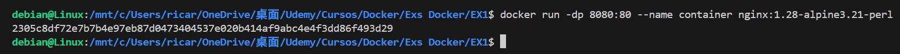

#### Confira se o container foi iniciado
```
docker ps
```

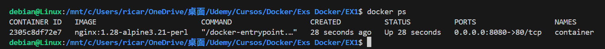

#### Após iniciado digite no navegador
```
localhost:8080
```


## 2. Criando e rodando um container interativo

### Objetivos:
- Iniciar um container Ubuntu
- Interagir com o terminal do container
- Testar um script bash dentro do container

#### Dockerfile
```
FROM ubuntu:20.04
RUN apt-get update && apt-get upgrade -y
RUN apt install nano -y
```
- FROM: Qual imagem vai ser carregada
- RUN: Comando para ser executado dentro da construção da imagem

#### Construa uma imagem do Nginx a partir do Dockerfile
```
docker build -t nome_imagem .
```

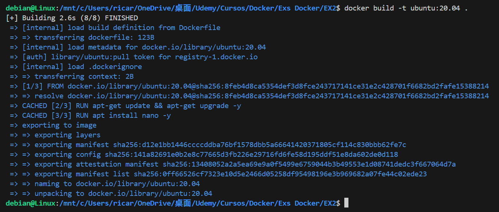

#### Entre no container 
```
docker run -it nome_imagem bash
```
- -it: Rodar o container em modo interativo

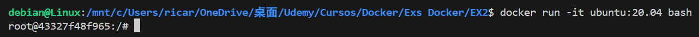

### Dentro do container crie um arquivo .sh

#### Criando script
```
nano script.sh
```

#### Dentro do script.sh digite:
```
#!/bin/bash

apt-get install curl -y
```

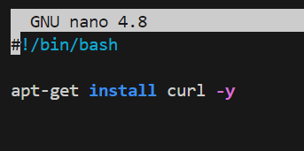

#### Salve o arquivo com CTL+O e saia com CTL+X

#### Dê permissão
```
chmod +x script.sh
```

#### Agora é só executar o script
```
./script.sh
```

#### Confira se foi instalado
```
curl --version
```

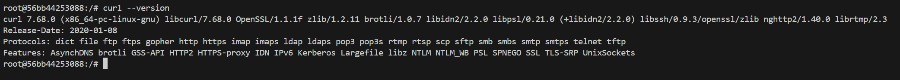

## 3. Listando e removendo containers

### Objetivos:
- Listar todos os containers em execução e parados
- Parar um container em execução
- Remover um container

#### Listando todos os containers em execução e parados
```
docker ps -a
```

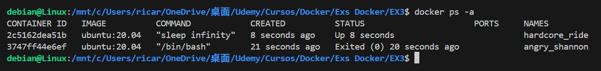

#### Parando um container em execução
```
docker stop nome_container
```

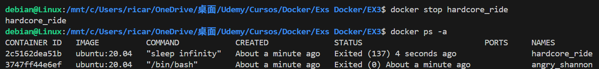

#### Removendo um container
```
docker container rm nome_container
```

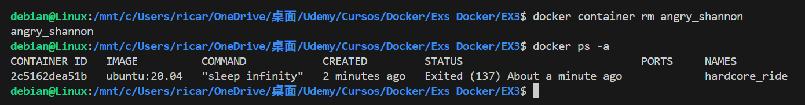


## 4. Criando um Dockerfile para uma aplicação simples em python

### Objetivos:
- Criar um Dockerfile para um aplicação Flask
- Retornar uma mensagem ao acessar o endpoint

#### Dockerfile
```
FROM python:3.13.3
WORKDIR /app
COPY requirements.txt .
RUN pip install --no-cache-dir -r requirements.txt
COPY app.py .
EXPOSE 4000
CMD [ "python", "app.py" ]
```

#### app.py
```
from flask import Flask

app = Flask(__name__)

@app.route("/")
def posto():
    return "<h1>Acabou a gasolina</h1>"

if __name__ == '__main__':
    app.run(host='0.0.0.0', port=4000)
```

#### requirements.txt
```
flask==2.2.5
```

#### Com o Dockerfile e os arquivos criados basta construir a imagem
```
docker build -t nome_imagem .
```

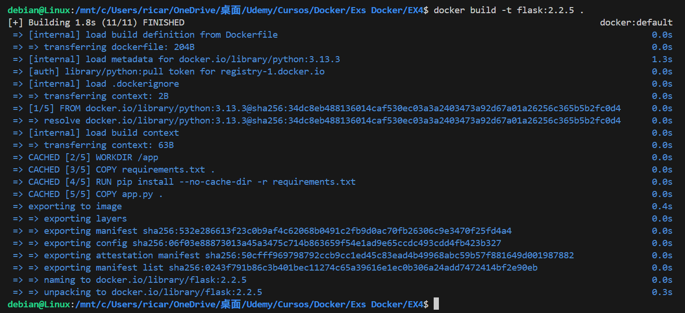

#### Criando um container a partir da imagem
```
docker run -dp 4000:4000 nome_imagem
```

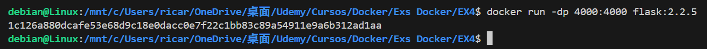

#### Confira se o container foi criado
```
docker ps
```


#### Após criar o container digite no navegador:
```
localhost:4000
```

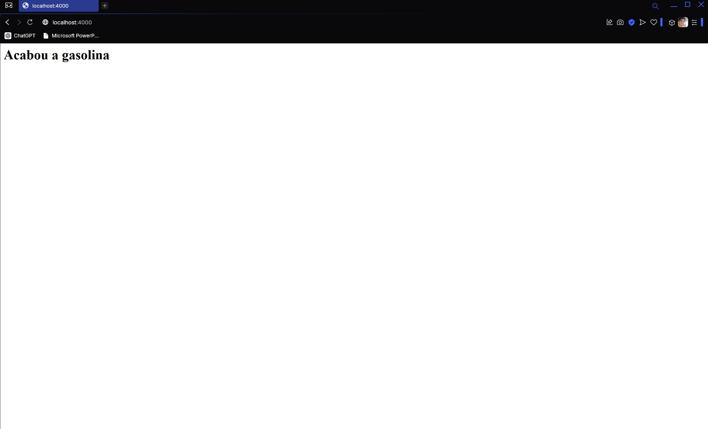

## 5. Criando e utilizando volumes para persistência de dados

### Objetivos:
- Executar um container MySQL
- Configurar um volume para armazenar os dados do banco de forma persistente

#### Dockerfile
```
FROM mysql:8.4.3
EXPOSE 3306
```

#### Criando volume
```
docker volume create nome_volume
```

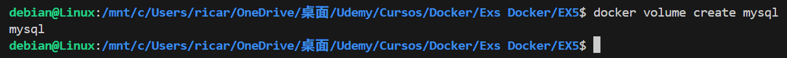

#### Construa a imagem com base no Dockerfile
```
docker build -t nome_imagem .
```

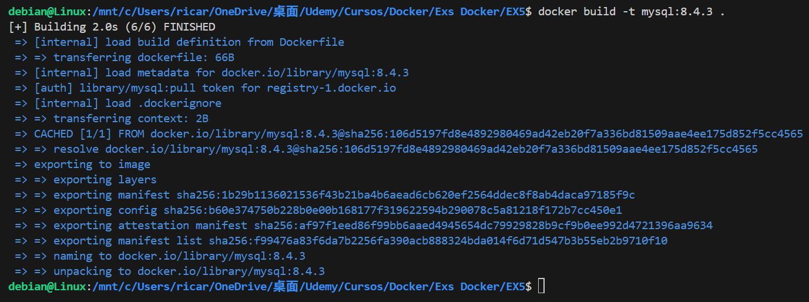

#### Crie o container a partir da imagem
```
docker run -dp 3306:3306 -e MYSQL_ROOT_PASSWORD=senha -v nome_volume:/caminho_volume nome_imagem
```

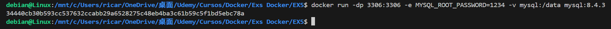

#### Confira se o container foi criado
```
docker ps
```

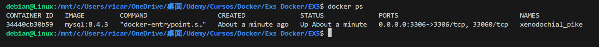

## 6. Criando e rodando um container multi-stage

### Objetivos:
- Utilizar multi-stage build para otimizar aplicação Go
- Reduzir o tamanho da imagem final

#### Dockerfile
```
FROM golang:1.24.1 AS build
WORKDIR /app
COPY go.mod go.sum ./
RUN go mod download
COPY . .
RUN CGO_ENABLED=0 GOOS=linux go build -o appGo

FROM alpine:3.18.12
COPY --from=build /app/appGo /
ENTRYPOINT ["/appGo"]
EXPOSE 8080
```

#### Com base no Dockerfile construa a imagem
```
docker build -t nome_imagem .
```

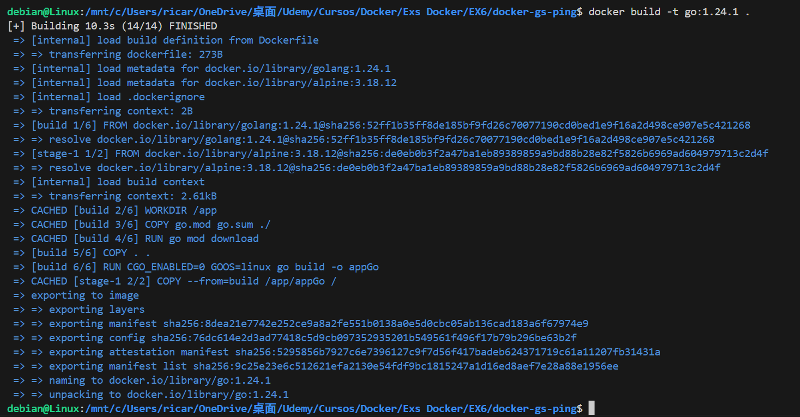

#### Com a imagem criada, agora é criar o container
```
docker run -dp 8080:8080 nome_imagem
```

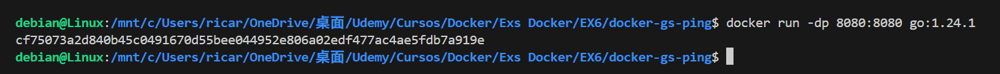

#### Confira se o container foi criado
```
docker ps
```

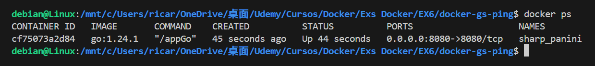

#### Com o container criado digite no navegador:
```
localhost:8080
```

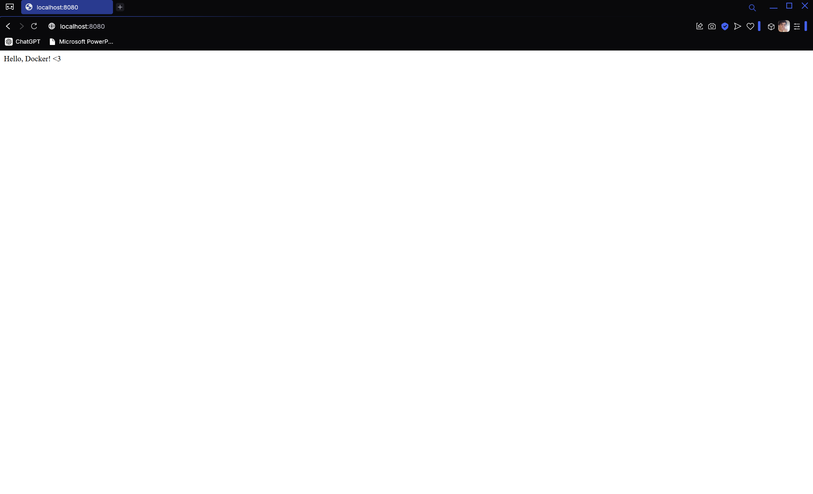

## 7. Construindo uma rede Docker para comunicação entre containers

### Objetivos:
- Criar uma rede Docker personalizada
- Na rede, criar dois containers: NodeJS e MongoDB
- Criar comunicação entre esses containers

#### Criando rede Docker
```
docker network create nome_rede
```

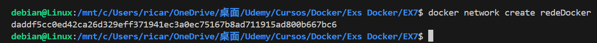

#### Conferindo a criação da rede
```
docker network ls
```

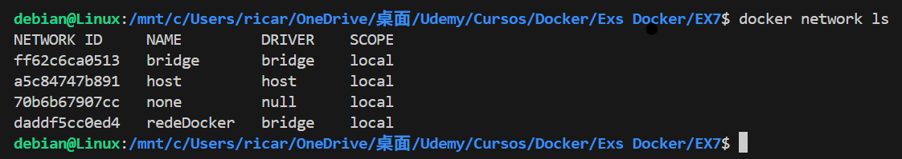

### Com a rede criada agora são os container

#### Primeiro as imagens
```
docker build -t mongo_imagem .
```

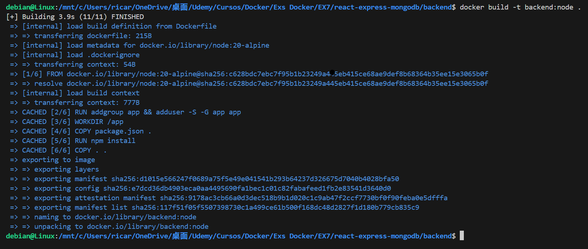

```
docker build -t node_imagem .
```

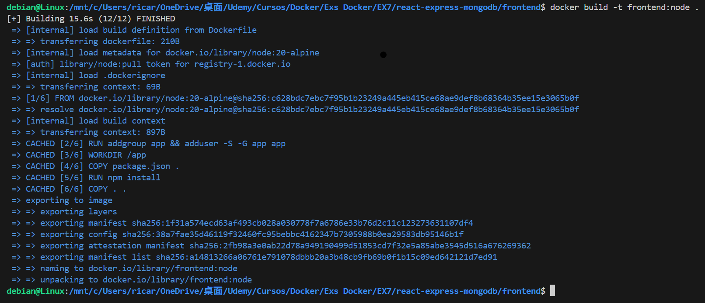

#### Agora sim os containers
```
docker run --name container_mongo --network nome_rede -d imagem_mongo
```

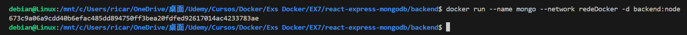

```
docker run --name container_node --network nome_rede -dp 5000:5000 imagem_node
```

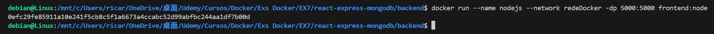

#### Confira se eles foram criados
```
docker ps
```

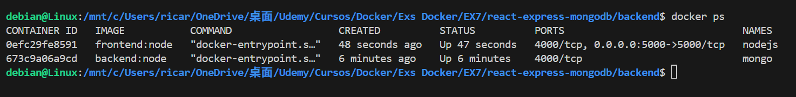

#### Com os containers rodando confira a rede
```
docker network inspect nome_rede
```

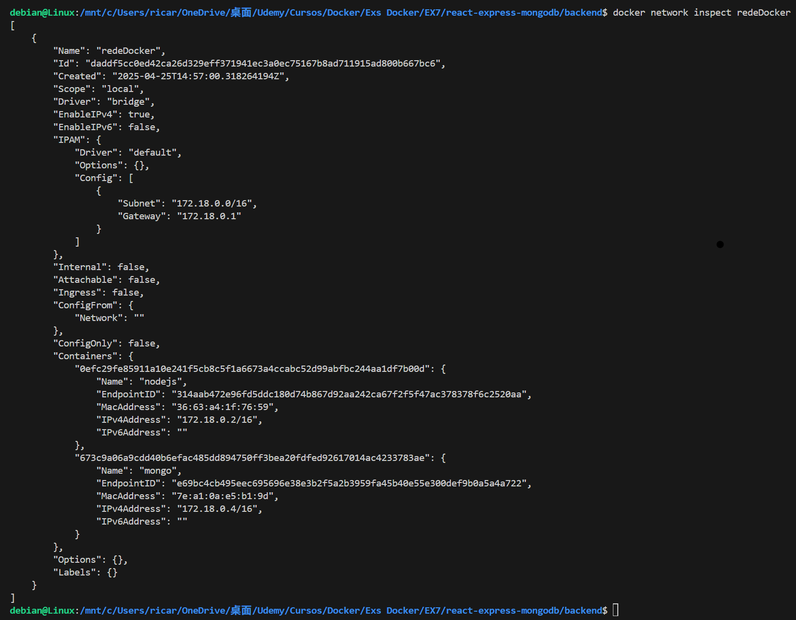
